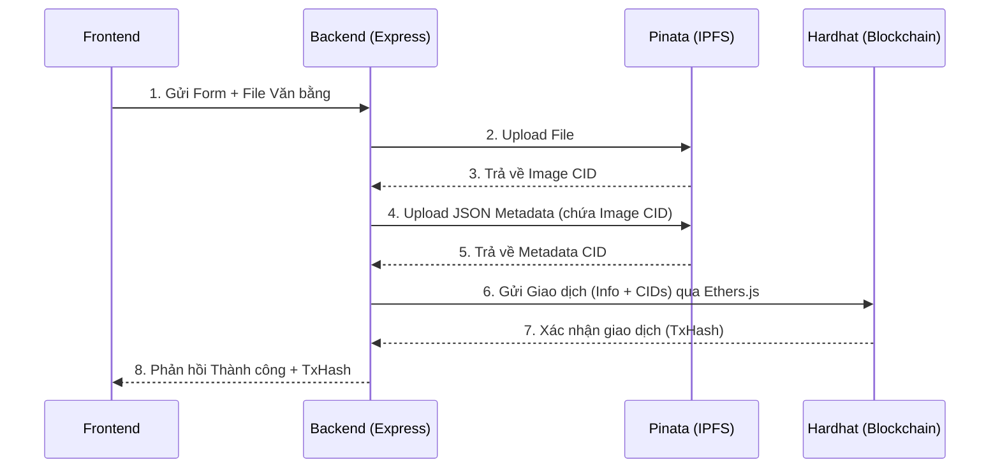

# Kiến trúc hệ thống: Sự giao tiếp giữa Backend, Blockchain, Pinata và Hardhat

Tài liệu này giải thích cách các thành phần trong dự án tương tác với nhau để hoàn thành một quy trình nghiệp vụ (ví dụ: Cấp phát văn bằng số).

---

## 1. Các thành phần chính

- **Backend (Node.js/Express):** Đóng vai trò là "người trung gian" (Orchestrator). Nó tiếp nhận yêu cầu từ Frontend, xử lý logic, giao tiếp với IPFS (qua Pinata) và ghi dữ liệu lên Blockchain (qua Ethers.js).
- **Pinata (IPFS):** IPFS (InterPlanetary File System) là hệ thống lưu trữ phi tập trung. Thay vì lưu file trên server riêng, ta lưu lên IPFS. Pinata là một dịch vụ (gateway) giúp chúng ta upload dữ liệu lên IPFS một cách dễ dàng thông qua API.
- **Hardhat:** Là công cụ phát triển Blockchain. Ở môi trường dev, Hardhat giả lập một mạng lưới Blockchain cục bộ (Local Node) tại địa chỉ `http://127.0.0.1:8545`. Nó cung cấp các tài khoản có sẵn tiền (Fake ETH) để Backend dùng làm phí giao dịch (Gas fee).
- **Smart Contract (Solidity):** Đoạn mã được triển khai lên mạng Blockchain (bởi Hardhat), chứa các quy tắc nghiệp vụ như: lưu trữ văn bằng, xác minh, thu hồi.

---

## 2. Luồng giao tiếp (Workflow) khi cấp phát văn bằng

Đây là luồng hoạt động chuẩn khi Backend thực hiện cấp phát một văn bằng mới:

### Bước 1: Nhận yêu cầu từ Frontend
- Người dùng (Admin/Trường học) điền thông tin và tải lên file văn bằng (PDF/Image) trên giao diện.
- Frontend gọi API POST `/api/certificates/issue` gửi dữ liệu này cho Backend.

### Bước 2: Tương tác với Pinata (Lưu trữ Off-chain)
*Lý do: Lưu file trực tiếp lên Blockchain tốn hàng ngàn đô la phí Gas, nên chúng ta chỉ lưu file lên IPFS và lấy về mã Hash.*
1. Backend nhận file PDF/Image, dùng thư viện Axios gọi API của **Pinata**.
2. Pinata lưu file vào mạng IPFS và trả về cho Backend một chuỗi gọi là **CID** (Content Identifier - ví dụ: `QmXyZ...`).
3. Backend tiếp tục tạo một cục dữ liệu **Metadata JSON** (chứa tên sinh viên, loại bằng, kèm theo đường link ảnh `ipfs://<CID>`).
4. Backend lại gọi Pinata để upload file JSON này lên IPFS và nhận về **Metadata CID**.

### Bước 3: Tương tác với Blockchain (Xác thực On-chain) qua Hardhat
1. Backend sử dụng thư viện **ethers.js** và thông tin tài khoản Admin (Private Key trong `.env`) để tạo kết nối tới **Hardhat Local Node** (RPC URL: `127.0.0.1:8545`).
2. Backend đóng gói các thông tin cốt lõi (Mã số SV, Loại bằng) CÙNG VỚI 2 mã Hash vừa nhận được từ Pinata (`ipfsCID` và `ipfsMetadataCID`) thành một giao dịch (Transaction).
3. Backend gửi giao dịch này gọi vào hàm `issueCertificate` của **Smart Contract** đã được deploy trên mạng Hardhat.
4. Hardhat xử lý giao dịch, tiêu tốn một ít ETH giả của Admin, sau đó ghi thông tin vĩnh viễn vào Block. Hardhat trả về cho Backend một **Mã giao dịch (TxHash)**.

### Bước 4: Lưu Database và Phản hồi
- Backend có thể lưu lại các ID, trạng thái giao dịch vào cơ sở dữ liệu truyền thống (PostgreSQL) để tiện truy vấn sau này.
- Cuối cùng, Backend trả về phản hồi cho Frontend báo cáo "Cấp phát thành công" kèm theo mã giao dịch TxHash.

---

## 3. Luồng giao tiếp khi xác minh văn bằng (Verify)

Quy trình xác minh rất nhanh vì nó chỉ là quá trình ĐỌC (Read) dữ liệu:
1. Frontend hoặc người dùng bên thứ ba cung cấp ID văn bằng (hoặc quét mã QR).
2. Backend dùng `ethers.js` kết nối tới **Hardhat Node**.
3. Backend gọi hàm `verifyCertificate` của Smart Contract. Giao dịch ĐỌC trên Blockchain **không tốn phí Gas**.
4. Blockchain trả về dữ liệu của văn bằng (bao gồm thông tin sinh viên và mã IPFS).
5. (Tuỳ chọn) Backend hoặc Frontend có thể dùng mã IPFS này gắn vào đường dẫn Pinata Gateway (vd: `https://gateway.pinata.cloud/ipfs/<CID>`) để hiển thị hình ảnh bằng cấp thật cho người dùng xem.

## Sơ đồ tóm tắt:

