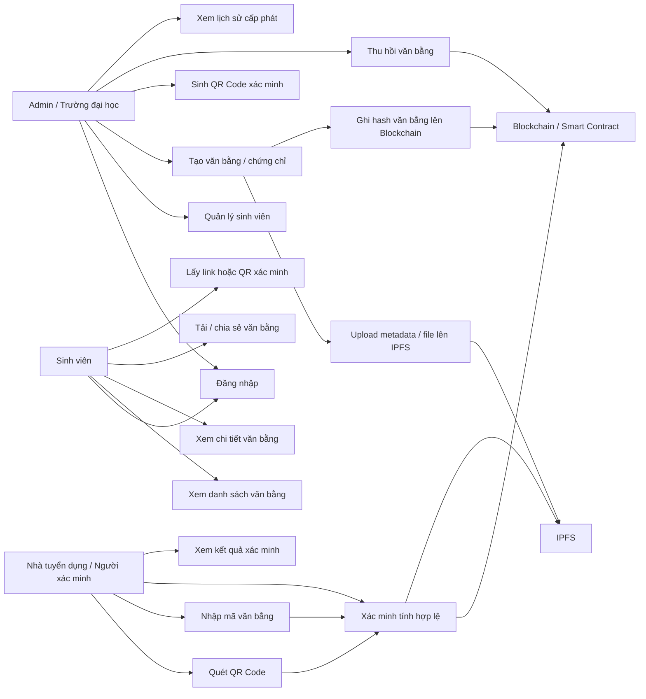
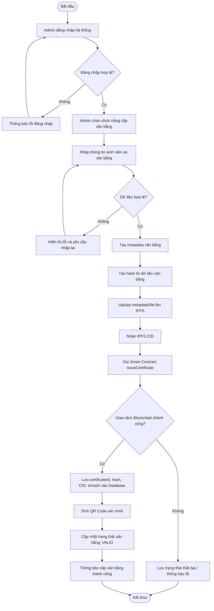
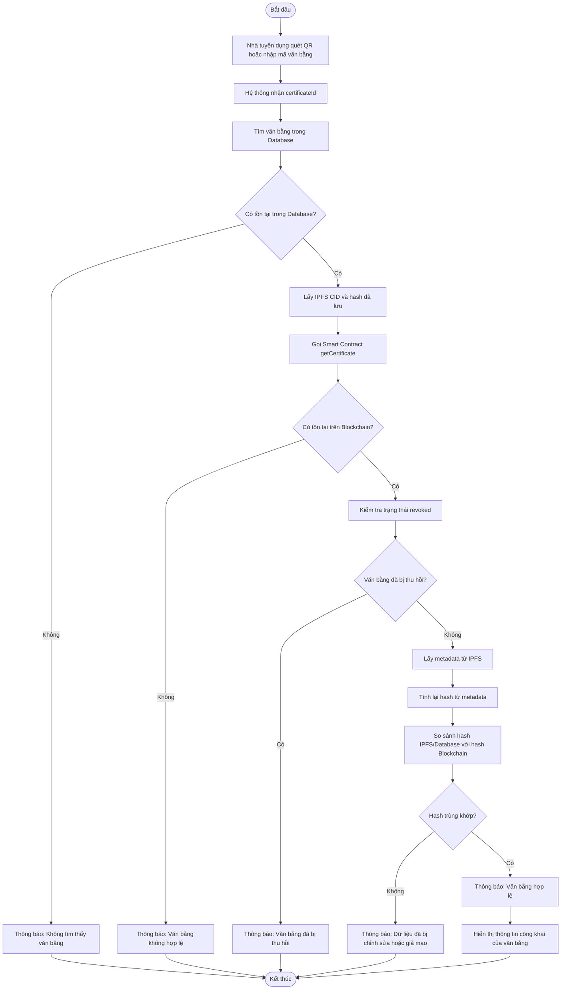
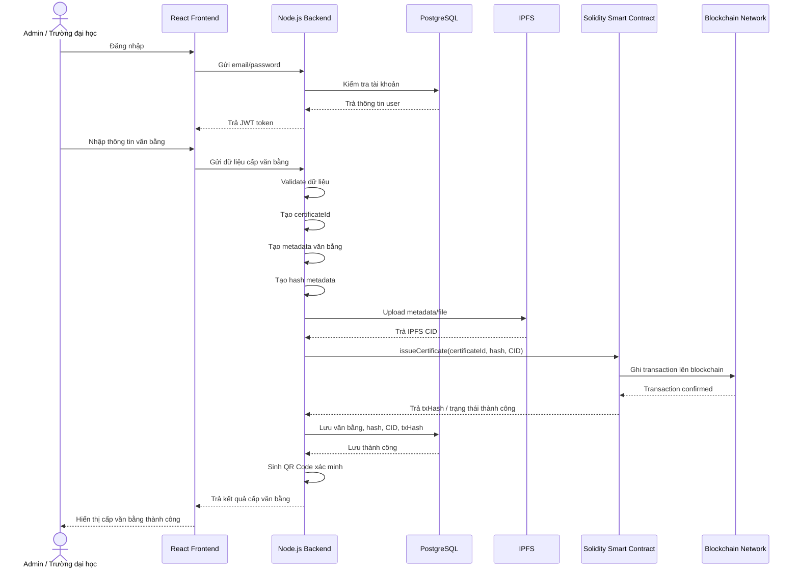
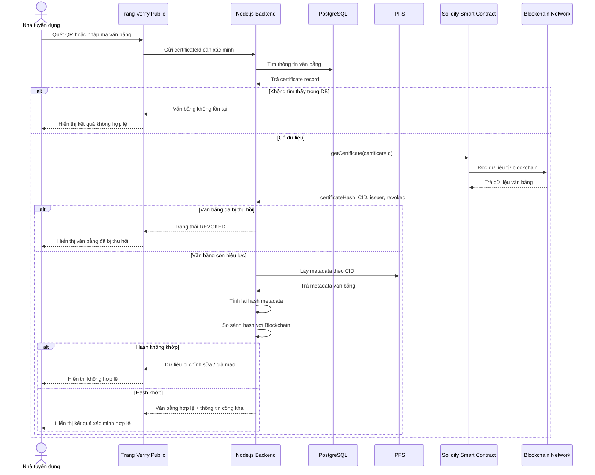
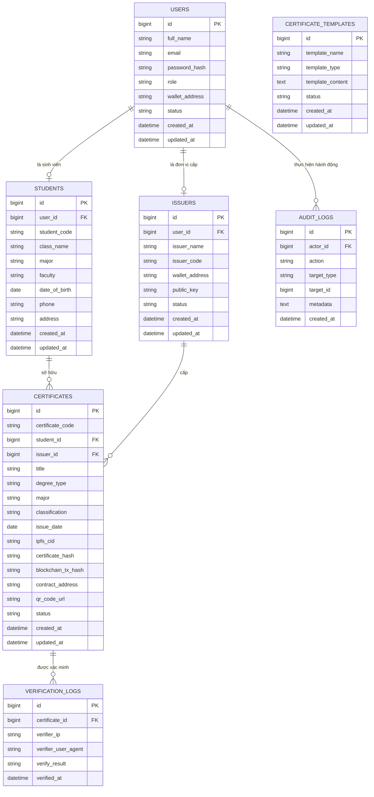

# Đề tài 47: Ứng dụng Blockchain để xây dựng hệ thống cấp phát, lưu trữ và xác minh văn bằng chứng chỉ chống giả mạo

## 1. Thông tin tổng quan đề tài

### Tên đề tài

**Ứng dụng Blockchain để xây dựng hệ thống cấp phát, lưu trữ và xác minh văn bằng chứng chỉ chống giả mạo**

### Tên tiếng Anh gợi ý

**A Blockchain-based System for Issuing, Storing and Verifying Academic Certificates**

### Công nghệ sử dụng hiện tại

Dự án được định hướng triển khai bằng các công nghệ:

- **Frontend:** ReactJS
- **Backend:** Node.js / Express.js
- **Database:** PostgreSQL
- **Blockchain development:** Hardhat
- **Smart Contract:** Solidity
- **Blockchain network:** Local Hardhat Network hoặc Ethereum Testnet
- **Storage phi tập trung:** IPFS
- **Xác minh nhanh:** QR Code
- **Ví blockchain:** MetaMask

---

## 2. Lý do chọn đề tài

Hiện nay, việc cấp phát và xác minh văn bằng, chứng chỉ vẫn còn nhiều hạn chế:

- Văn bằng giấy hoặc file PDF dễ bị làm giả.
- Nhà tuyển dụng khó xác minh nhanh tính hợp lệ của văn bằng.
- Việc xác minh truyền thống thường cần liên hệ trực tiếp với trường hoặc đơn vị cấp.
- Nếu chỉ lưu dữ liệu trong database tập trung, dữ liệu có thể bị chỉnh sửa bởi người có quyền quản trị.
- Cần một hệ thống minh bạch, khó giả mạo, có thể xác minh nhanh bằng mã QR hoặc mã văn bằng.

Blockchain phù hợp với bài toán này vì dữ liệu sau khi ghi lên blockchain có tính bất biến, khó chỉnh sửa và có thể kiểm tra công khai. Tuy nhiên, blockchain không phù hợp để lưu toàn bộ file văn bằng, do đó hệ thống sẽ kết hợp:

- **PostgreSQL** để lưu dữ liệu nghiệp vụ.
- **IPFS** để lưu metadata/file văn bằng.
- **Blockchain/Smart Contract** để lưu hash, CID và trạng thái xác thực.
- **QR Code** để hỗ trợ xác minh nhanh.

---

## 3. Mục tiêu của đề tài

### Mục tiêu tổng quát

Xây dựng hệ thống web hỗ trợ cấp phát, lưu trữ và xác minh văn bằng/chứng chỉ bằng công nghệ blockchain, giúp hạn chế giả mạo và tăng độ tin cậy trong quá trình xác minh.

### Mục tiêu cụ thể

- Xây dựng hệ thống gồm 3 nhóm người dùng chính:
  - Admin / Trường đại học
  - Sinh viên
  - Nhà tuyển dụng / Người xác minh
- Xây dựng smart contract để lưu thông tin xác thực của văn bằng.
- Tích hợp IPFS để lưu metadata hoặc file văn bằng.
- Tạo mã QR cho từng văn bằng.
- Cho phép nhà tuyển dụng xác minh văn bằng bằng QR hoặc mã văn bằng.
- Cho phép thu hồi văn bằng nếu cấp sai hoặc có vấn đề.
- So sánh ưu nhược điểm của giải pháp blockchain so với hệ thống lưu trữ truyền thống.

---

## 4. Phạm vi hệ thống

### Trong phạm vi làm tốt nghiệp

Hệ thống nên tập trung vào các chức năng chính:

- Đăng nhập và phân quyền người dùng.
- Admin quản lý sinh viên.
- Admin cấp văn bằng/chứng chỉ.
- Upload metadata hoặc file lên IPFS.
- Ghi hash và CID lên blockchain thông qua smart contract.
- Sinh QR Code xác minh.
- Sinh viên xem và chia sẻ văn bằng.
- Nhà tuyển dụng xác minh văn bằng.
- Admin thu hồi văn bằng.
- Lưu lịch sử xác minh và nhật ký thao tác.

### Ngoài phạm vi hoặc hướng phát triển sau

- Không cần làm app mobile riêng.
- Không cần triển khai mainnet thật.
- Không cần dùng chuẩn W3C Verifiable Credentials đầy đủ ở bản đầu.
- Không cần lưu toàn bộ file văn bằng trực tiếp trên blockchain.
- Không cần tích hợp định danh phi tập trung DID ở giai đoạn MVP.

---

## 5. Vai trò người dùng

## 5.1. Admin / Trường đại học

Admin là đơn vị có quyền cấp phát và quản lý văn bằng.

### Chức năng chính

- Đăng nhập hệ thống.
- Quản lý sinh viên.
- Tạo văn bằng/chứng chỉ.
- Upload metadata/file văn bằng lên IPFS.
- Ghi hash văn bằng lên blockchain.
- Sinh QR Code xác minh.
- Xem danh sách văn bằng đã cấp.
- Thu hồi văn bằng.
- Xem lịch sử xác minh.
- Xem nhật ký thao tác hệ thống.

---

## 5.2. Sinh viên

Sinh viên là người sở hữu văn bằng được cấp.

### Chức năng chính

- Đăng nhập hệ thống.
- Xem danh sách văn bằng của mình.
- Xem chi tiết văn bằng.
- Tải hoặc xem file văn bằng.
- Lấy link xác minh.
- Lấy QR Code xác minh.
- Chia sẻ văn bằng cho nhà tuyển dụng.

---

## 5.3. Nhà tuyển dụng / Người xác minh

Nhà tuyển dụng là người kiểm tra tính hợp lệ của văn bằng.

### Chức năng chính

- Không bắt buộc đăng nhập.
- Quét QR Code.
- Nhập mã văn bằng.
- Xác minh văn bằng.
- Xem kết quả xác minh:
  - Hợp lệ
  - Không tồn tại
  - Đã bị thu hồi
  - Dữ liệu bị chỉnh sửa hoặc giả mạo

---

## 5.4. Mở rộng nghiệp vụ: mô hình nhà cung cấp nền tảng cho nhiều trường

Nếu hệ thống không chỉ phục vụ một trường duy nhất mà được triển khai như một nền tảng cho nhiều trường đại học, học viện hoặc trung tâm đào tạo đăng ký sử dụng, cần tách rõ vai trò **nhà cung cấp nền tảng** và **đơn vị cấp bằng**.

Trong mô hình này, vai trò `Admin / Trường đại học` ở bản MVP nên được tách thành nhiều vai trò chi tiết hơn:

| Vai trò | Ý nghĩa | Quyền chính |
|---|---|---|
| `super_admin` | Bên vận hành nền tảng | Duyệt/tạo trường, khóa trường, quản lý cấu hình hệ thống, triển khai/gán contract cho trường |
| `institution_admin` | Quản trị viên của trường/học viện | Quản lý sinh viên, quản lý người cấp bằng, cấp/thu hồi văn bằng của trường mình |
| `issuer` | Cán bộ được trường ủy quyền cấp bằng | Cấp văn bằng, xem văn bằng do mình hoặc đơn vị mình cấp tùy chính sách |
| `student` | Sinh viên/người học | Xem văn bằng của mình, chia sẻ link/QR xác minh |
| `public_verifier` | Nhà tuyển dụng/người xác minh | Xác minh công khai bằng QR hoặc mã văn bằng, không cần đăng nhập |

### Lý do cần `super_admin`

Nếu chỉ có `admin`, hệ thống sẽ không rõ `admin` là bên cung cấp nền tảng hay là nhà trường. Khi có nhiều trường cùng sử dụng, cần một vai trò cao nhất để:

- Tiếp nhận yêu cầu đăng ký của trường/học viện.
- Duyệt hoặc từ chối đơn vị tham gia hệ thống.
- Tạo tài khoản `institution_admin` đầu tiên cho từng trường.
- Quản lý trạng thái hoạt động của trường: `PENDING`, `ACTIVE`, `SUSPENDED`.
- Cấu hình blockchain cho từng trường: ví, contract address, chain id.
- Theo dõi tổng quan toàn hệ thống nhưng không can thiệp tùy tiện vào nghiệp vụ nội bộ nếu không cần.

### Khái niệm Institution

Để hỗ trợ nhiều trường, database cần thêm thực thể `Institution`.

Ví dụ:

```prisma
model Institution {
  id              String   @id @default(uuid())
  name            String
  code            String   @unique
  walletAddress   String?  @unique
  contractAddress String?
  chainId         Int?
  status          String   @default("PENDING")
  createdAt       DateTime @default(now())
  updatedAt       DateTime @updatedAt

  users        User[]
  certificates Certificate[]
}
```

Khi đó `User` nên có thêm:

```prisma
institutionId String?
institution   Institution?
role          String
```

Và `Certificate` nên có:

```prisma
institutionId String
institution   Institution
```

Như vậy, mỗi văn bằng luôn thuộc về một trường cụ thể. Điều này giúp tránh trường A xem, cấp hoặc thu hồi nhầm văn bằng của trường B.

### Liên kết văn bằng với tài khoản sinh viên

Ở hệ thống hiện tại, liên kết văn bằng với sinh viên đang dựa trên mã sinh viên:

```text
User.studentId  <->  Certificate.studentCode
```

Khi admin cấp văn bằng, backend nhận `studentId`, tìm tài khoản sinh viên có cùng `studentId`, rồi lưu `studentUserId` nếu tìm thấy. Nếu tài khoản sinh viên chưa tồn tại, văn bằng vẫn lưu `studentCode`; khi sinh viên đăng ký sau với đúng mã sinh viên, hệ thống vẫn có thể hiển thị các văn bằng có `studentCode` tương ứng.

Với mô hình nhiều trường, liên kết nên chặt hơn:

```text
User.institutionId + User.studentId
        <->
Certificate.institutionId + Certificate.studentCode
```

Điều này quan trọng vì hai trường khác nhau có thể cùng dùng một mã sinh viên như `SV001`. Nếu chỉ dùng `studentId` toàn hệ thống, dữ liệu có thể bị trùng hoặc gắn sai.

Ràng buộc nên dùng:

```text
unique(institutionId, studentId)
unique(institutionId, certificateCode)
```

Thay vì bắt `studentId` hoặc `certificateCode` là duy nhất trên toàn hệ thống.

### Luồng đăng ký trường/học viện

```text
Trường gửi yêu cầu đăng ký
   ↓
Super admin xem thông tin đơn vị
   ↓
Super admin duyệt trường
   ↓
Hệ thống tạo Institution
   ↓
Hệ thống tạo tài khoản institution_admin
   ↓
Super admin triển khai hoặc gán smart contract cho trường
   ↓
Institution admin đăng nhập
   ↓
Institution admin tạo sinh viên / issuer
   ↓
Institution admin hoặc issuer cấp văn bằng
```

### Lựa chọn thiết kế smart contract cho nhiều trường

Có hai hướng chính.

#### Hướng 1: Mỗi trường một smart contract riêng

```text
Đại học A  -> CertificateRegistry contract A
Học viện B -> CertificateRegistry contract B
```

Ưu điểm:

- Phù hợp với contract hiện tại vì contract có `institutionName`.
- Quyền `ADMIN_ROLE` và `ISSUER_ROLE` được cô lập theo từng trường.
- Trường A không thể cấp hoặc thu hồi văn bằng của trường B.
- Dễ giải thích trong báo cáo và dễ demo.

Nhược điểm:

- Phải deploy nhiều contract nếu có nhiều trường.
- Backend phải chọn `contractAddress` theo `institutionId`, không dùng một biến môi trường global cho toàn hệ thống.

Đây là hướng phù hợp nhất với kiến trúc hiện tại.

#### Hướng 2: Một smart contract dùng chung cho nhiều trường

Contract cần lưu thêm `institutionId` hoặc `institutionCode` cho từng văn bằng, đồng thời phân quyền issuer theo từng trường.

Ví dụ logic cần có:

```text
institutionCode + certificateCode -> CertificateProof
issuer address chỉ được cấp bằng cho institutionCode mà họ thuộc về
```

Ưu điểm:

- Chỉ cần một contract.
- Dễ thống kê toàn hệ thống trên một contract.

Nhược điểm:

- Contract phức tạp hơn nhiều.
- Nếu thiết kế quyền không chặt, issuer của trường này có thể ảnh hưởng dữ liệu trường khác.
- Khó sửa hơn nếu đã deploy.

Với đề tài tốt nghiệp và code hiện tại, nên ưu tiên **mỗi trường một contract riêng**.

### Thay đổi backend cần có

Hiện tại backend dùng:

```js
process.env.CONTRACT_ADDRESS
```

Điều này phù hợp với MVP một trường, nhưng chưa phù hợp với mô hình nhiều trường.

Với nhiều trường, backend nên lấy contract theo trường:

```text
req.user.institutionId
   ↓
Institution.contractAddress
   ↓
ethers.Contract(contractAddress, abi, signer)
```

Khi cấp văn bằng:

```text
institution_admin / issuer đăng nhập
   ↓
Backend xác định institutionId từ JWT
   ↓
Backend kiểm tra quyền trong phạm vi trường đó
   ↓
Backend tạo certificate thuộc institutionId
   ↓
Backend gọi contract của đúng institution
```

Khi xác minh công khai:

- Nếu mã QR chứa cả `institutionCode` và `certificateCode`, backend sẽ tìm đúng trường nhanh hơn.
- Nếu chỉ có `certificateCode`, hệ thống phải tìm trong database trước để biết văn bằng thuộc trường nào.

QR/link xác minh nên có dạng:

```text
https://domain.com/verify/{institutionCode}/{certificateCode}
```

hoặc:

```text
https://domain.com/verify?institution=ABCU&code=VB-2026-0001
```

### Quyền trên blockchain và quyền trong backend

Cần phân biệt hai lớp quyền:

| Lớp quyền | Nằm ở đâu | Dùng để làm gì |
|---|---|---|
| Backend RBAC | PostgreSQL/JWT | Kiểm soát ai được vào màn hình nào, API nào |
| Smart contract role | Blockchain | Kiểm soát ví nào được gọi `issueCertificate`, `revokeCertificate` |

Ví dụ:

- `super_admin` trong backend có quyền duyệt trường.
- Ví deployer hoặc ví nền tảng giữ `DEFAULT_ADMIN_ROLE`.
- Ví của trường có `ADMIN_ROLE` trên contract riêng của trường.
- Ví cấp bằng có `ISSUER_ROLE`.

Nếu backend vẫn dùng một private key duy nhất để ký tất cả giao dịch, thì về mặt kỹ thuật mọi văn bằng đều do ví backend ký. Cách này đơn giản cho demo nhưng chưa thể hiện rõ mỗi trường có ví riêng. Bản nâng cấp nên hỗ trợ ví/khóa ký theo từng institution hoặc có cơ chế cấp quyền on-chain cho ví của từng trường.

### Phạm vi khuyến nghị cho đồ án

Để đồ án không bị quá rộng, có thể trình bày theo hai mức:

- **MVP triển khai:** một trường, role `admin`, `student`, public verify.
- **Hướng mở rộng nghiệp vụ:** thêm `super_admin`, `institution_admin`, `issuer`, `Institution`, mỗi trường một contract riêng.

Cách trình bày này giúp hệ thống hiện tại vẫn đủ để demo, đồng thời thể hiện được hướng phát triển thực tế nếu sản phẩm trở thành nền tảng cho nhiều trường/học viện.

---

## 6. Kiến trúc hệ thống

## 6.1. Kiến trúc tổng thể

```text
Người dùng
   |
   v
React Frontend
   |
   v
Node.js / Express Backend
   |
   |---- PostgreSQL Database
   |
   |---- IPFS Storage
   |
   |---- Smart Contract Solidity
             |
             v
       Blockchain Network
```

---

## 6.2. Vai trò từng thành phần

### ReactJS Frontend

Frontend cung cấp giao diện cho:

- Admin quản lý và cấp văn bằng.
- Sinh viên xem và chia sẻ văn bằng.
- Nhà tuyển dụng xác minh văn bằng.

Các trang chính:

- Login
- Admin Dashboard
- Student Management
- Certificate Management
- Issue Certificate
- Student Certificate List
- Certificate Detail
- Public Verify Page
- Verification Result Page

---

### Node.js Backend

Backend là tầng xử lý nghiệp vụ chính.

Nhiệm vụ:

- Xác thực người dùng.
- Phân quyền theo role.
- Quản lý dữ liệu trong PostgreSQL.
- Tạo hash dữ liệu văn bằng.
- Upload dữ liệu lên IPFS.
- Gọi smart contract.
- Sinh QR Code.
- Xử lý xác minh văn bằng.
- Ghi log hệ thống.

---

### PostgreSQL

PostgreSQL lưu dữ liệu nghiệp vụ:

- Người dùng
- Sinh viên
- Đơn vị cấp bằng
- Văn bằng
- Lịch sử xác minh
- Nhật ký thao tác

PostgreSQL không thay thế blockchain. Nó giúp hệ thống truy vấn nhanh và quản lý nghiệp vụ dễ hơn.

---

### IPFS

IPFS lưu metadata hoặc file văn bằng.

Nội dung có thể lưu trên IPFS:

```json
{
  "certificateCode": "CERT-2026-0001",
  "studentName": "Nguyen Van A",
  "studentCode": "SV001",
  "degreeTitle": "Bachelor of Information Technology",
  "major": "Information Technology",
  "classification": "Good",
  "issueDate": "2026-06-07",
  "issuer": "ABC University"
}
```

Sau khi upload lên IPFS, hệ thống nhận được **CID**. CID này sẽ được lưu trong database và smart contract.

---

### Smart Contract Solidity

Smart contract lưu bằng chứng xác thực của văn bằng.

Không lưu toàn bộ thông tin cá nhân lên blockchain.

Chỉ nên lưu:

- certificateId
- certificateHash
- ipfsCID
- issuer
- issuedAt
- revoked

---

### Hardhat

Hardhat dùng để:

- Viết smart contract.
- Compile contract.
- Test contract.
- Deploy contract lên local network hoặc testnet.
- Quản lý script deploy.
- Kiểm thử các hàm issue, verify, revoke.

---

## 7. Luồng nghiệp vụ chính

## 7.1. Luồng cấp phát văn bằng

```text
Admin đăng nhập
   ↓
Admin nhập thông tin văn bằng
   ↓
Backend validate dữ liệu
   ↓
Backend tạo metadata văn bằng
   ↓
Backend tạo hash từ metadata
   ↓
Backend upload metadata/file lên IPFS
   ↓
IPFS trả CID
   ↓
Backend gọi smart contract issueCertificate()
   ↓
Blockchain ghi certificateId, hash, CID
   ↓
Backend lưu dữ liệu vào PostgreSQL
   ↓
Backend sinh QR Code
   ↓
Admin nhận kết quả cấp văn bằng thành công
```

---

## 7.2. Luồng xác minh văn bằng

```text
Nhà tuyển dụng quét QR hoặc nhập mã văn bằng
   ↓
Frontend gửi certificateId lên Backend
   ↓
Backend tìm văn bằng trong PostgreSQL
   ↓
Backend gọi smart contract getCertificate()
   ↓
Backend lấy metadata từ IPFS
   ↓
Backend tính lại hash metadata
   ↓
So sánh hash mới với hash trên blockchain
   ↓
Kiểm tra trạng thái revoked
   ↓
Trả kết quả xác minh
```

---

## 8. Use Case Diagram



---

## 9. Activity Diagram - Quy trình cấp văn bằng



---

## 10. Activity Diagram - Quy trình xác minh văn bằng



---

## 11. Sequence Diagram - Admin cấp văn bằng



---

## 12. Sequence Diagram - Nhà tuyển dụng xác minh văn bằng



---

## 13. ERD - Sơ đồ cơ sở dữ liệu



---

## 14. Thiết kế database PostgreSQL đề xuất

## 14.1. Bảng users

```sql
CREATE TABLE users (
    id BIGSERIAL PRIMARY KEY,
    full_name VARCHAR(255) NOT NULL,
    email VARCHAR(255) UNIQUE NOT NULL,
    password_hash TEXT NOT NULL,
    role VARCHAR(50) NOT NULL CHECK (role IN ('ADMIN', 'STUDENT', 'EMPLOYER')),
    wallet_address VARCHAR(255),
    status VARCHAR(50) DEFAULT 'ACTIVE',
    created_at TIMESTAMP DEFAULT CURRENT_TIMESTAMP,
    updated_at TIMESTAMP DEFAULT CURRENT_TIMESTAMP
);
```

---

## 14.2. Bảng students

```sql
CREATE TABLE students (
    id BIGSERIAL PRIMARY KEY,
    user_id BIGINT REFERENCES users(id),
    student_code VARCHAR(100) UNIQUE NOT NULL,
    class_name VARCHAR(100),
    major VARCHAR(255),
    faculty VARCHAR(255),
    date_of_birth DATE,
    phone VARCHAR(50),
    address TEXT,
    created_at TIMESTAMP DEFAULT CURRENT_TIMESTAMP,
    updated_at TIMESTAMP DEFAULT CURRENT_TIMESTAMP
);
```

---

## 14.3. Bảng issuers

```sql
CREATE TABLE issuers (
    id BIGSERIAL PRIMARY KEY,
    user_id BIGINT REFERENCES users(id),
    issuer_name VARCHAR(255) NOT NULL,
    issuer_code VARCHAR(100) UNIQUE NOT NULL,
    wallet_address VARCHAR(255) NOT NULL,
    public_key TEXT,
    status VARCHAR(50) DEFAULT 'ACTIVE',
    created_at TIMESTAMP DEFAULT CURRENT_TIMESTAMP,
    updated_at TIMESTAMP DEFAULT CURRENT_TIMESTAMP
);
```

---

## 14.4. Bảng certificates

```sql
CREATE TABLE certificates (
    id BIGSERIAL PRIMARY KEY,
    certificate_code VARCHAR(100) UNIQUE NOT NULL,
    student_id BIGINT REFERENCES students(id),
    issuer_id BIGINT REFERENCES issuers(id),
    title VARCHAR(255) NOT NULL,
    degree_type VARCHAR(100),
    major VARCHAR(255),
    classification VARCHAR(100),
    issue_date DATE,
    ipfs_cid TEXT,
    certificate_hash TEXT,
    blockchain_tx_hash TEXT,
    contract_address TEXT,
    qr_code_url TEXT,
    status VARCHAR(50) DEFAULT 'PENDING',
    created_at TIMESTAMP DEFAULT CURRENT_TIMESTAMP,
    updated_at TIMESTAMP DEFAULT CURRENT_TIMESTAMP
);
```

---

## 14.5. Bảng verification_logs

```sql
CREATE TABLE verification_logs (
    id BIGSERIAL PRIMARY KEY,
    certificate_id BIGINT REFERENCES certificates(id),
    verifier_ip VARCHAR(100),
    verifier_user_agent TEXT,
    verify_result VARCHAR(100),
    verified_at TIMESTAMP DEFAULT CURRENT_TIMESTAMP
);
```

---

## 14.6. Bảng audit_logs

```sql
CREATE TABLE audit_logs (
    id BIGSERIAL PRIMARY KEY,
    actor_id BIGINT REFERENCES users(id),
    action VARCHAR(255) NOT NULL,
    target_type VARCHAR(100),
    target_id BIGINT,
    metadata JSONB,
    created_at TIMESTAMP DEFAULT CURRENT_TIMESTAMP
);
```

---

## 14.7. Bảng certificate_templates

```sql
CREATE TABLE certificate_templates (
    id BIGSERIAL PRIMARY KEY,
    template_name VARCHAR(255) NOT NULL,
    template_type VARCHAR(100),
    template_content TEXT,
    status VARCHAR(50) DEFAULT 'ACTIVE',
    created_at TIMESTAMP DEFAULT CURRENT_TIMESTAMP,
    updated_at TIMESTAMP DEFAULT CURRENT_TIMESTAMP
);
```

---

## 15. Smart Contract Solidity đề xuất

```solidity
// SPDX-License-Identifier: MIT
pragma solidity ^0.8.20;

contract CertificateRegistry {
    address public owner;

    struct Certificate {
        string certificateId;
        string certificateHash;
        string ipfsCID;
        address issuer;
        uint256 issuedAt;
        bool revoked;
        bool exists;
    }

    mapping(string => Certificate) private certificates;
    mapping(address => bool) public authorizedIssuers;

    event IssuerAuthorized(address indexed issuer);
    event IssuerRemoved(address indexed issuer);
    event CertificateIssued(
        string indexed certificateId,
        string certificateHash,
        string ipfsCID,
        address indexed issuer,
        uint256 issuedAt
    );
    event CertificateRevoked(string indexed certificateId, address indexed issuer);

    modifier onlyOwner() {
        require(msg.sender == owner, "Only owner");
        _;
    }

    modifier onlyAuthorizedIssuer() {
        require(authorizedIssuers[msg.sender], "Not authorized issuer");
        _;
    }

    constructor() {
        owner = msg.sender;
        authorizedIssuers[msg.sender] = true;
    }

    function authorizeIssuer(address issuer) external onlyOwner {
        authorizedIssuers[issuer] = true;
        emit IssuerAuthorized(issuer);
    }

    function removeIssuer(address issuer) external onlyOwner {
        authorizedIssuers[issuer] = false;
        emit IssuerRemoved(issuer);
    }

    function issueCertificate(
        string memory certificateId,
        string memory certificateHash,
        string memory ipfsCID
    ) external onlyAuthorizedIssuer {
        require(!certificates[certificateId].exists, "Certificate already exists");

        certificates[certificateId] = Certificate({
            certificateId: certificateId,
            certificateHash: certificateHash,
            ipfsCID: ipfsCID,
            issuer: msg.sender,
            issuedAt: block.timestamp,
            revoked: false,
            exists: true
        });

        emit CertificateIssued(
            certificateId,
            certificateHash,
            ipfsCID,
            msg.sender,
            block.timestamp
        );
    }

    function revokeCertificate(string memory certificateId) external onlyAuthorizedIssuer {
        require(certificates[certificateId].exists, "Certificate does not exist");
        require(certificates[certificateId].issuer == msg.sender, "Only issuer can revoke");

        certificates[certificateId].revoked = true;

        emit CertificateRevoked(certificateId, msg.sender);
    }

    function getCertificate(string memory certificateId)
        external
        view
        returns (
            string memory,
            string memory,
            string memory,
            address,
            uint256,
            bool,
            bool
        )
    {
        Certificate memory cert = certificates[certificateId];

        return (
            cert.certificateId,
            cert.certificateHash,
            cert.ipfsCID,
            cert.issuer,
            cert.issuedAt,
            cert.revoked,
            cert.exists
        );
    }

    function verifyCertificate(
        string memory certificateId,
        string memory certificateHash
    ) external view returns (bool) {
        Certificate memory cert = certificates[certificateId];

        if (!cert.exists) {
            return false;
        }

        if (cert.revoked) {
            return false;
        }

        return keccak256(abi.encodePacked(cert.certificateHash)) ==
            keccak256(abi.encodePacked(certificateHash));
    }
}
```

---

## 16. Cấu trúc thư mục dự án đề xuất

```text
certificate-blockchain-system/
│
├── frontend/
│   ├── src/
│   │   ├── assets/
│   │   ├── components/
│   │   ├── layouts/
│   │   ├── pages/
│   │   │   ├── auth/
│   │   │   ├── admin/
│   │   │   ├── student/
│   │   │   └── verify/
│   │   ├── routes/
│   │   ├── services/
│   │   ├── hooks/
│   │   ├── utils/
│   │   ├── store/
│   │   └── App.jsx
│   ├── package.json
│   └── vite.config.js
│
├── backend/
│   ├── src/
│   │   ├── config/
│   │   │   ├── db.js
│   │   │   ├── ipfs.js
│   │   │   └── blockchain.js
│   │   ├── controllers/
│   │   ├── middlewares/
│   │   ├── models/
│   │   ├── repositories/
│   │   ├── routes/
│   │   ├── services/
│   │   │   ├── auth.service.js
│   │   │   ├── certificate.service.js
│   │   │   ├── blockchain.service.js
│   │   │   ├── ipfs.service.js
│   │   │   └── qr.service.js
│   │   ├── utils/
│   │   └── app.js
│   ├── package.json
│   └── .env
│
├── blockchain/
│   ├── contracts/
│   │   └── CertificateRegistry.sol
│   ├── scripts/
│   │   └── deploy.js
│   ├── test/
│   │   └── CertificateRegistry.test.js
│   ├── hardhat.config.js
│   └── package.json
│
├── database/
│   ├── migrations/
│   ├── seeders/
│   └── schema.sql
│
├── docs/
│   ├── diagrams.md
│   ├── api.md
│   └── report-outline.md
│
└── README.md
```

---

## 17. API Backend đề xuất

## 17.1. Auth API

```text
POST /api/auth/login
POST /api/auth/register
GET  /api/auth/me
POST /api/auth/logout
```

---

## 17.2. Student API

```text
GET    /api/students
GET    /api/students/:id
POST   /api/students
PUT    /api/students/:id
DELETE /api/students/:id
```

---

## 17.3. Certificate API

```text
GET    /api/certificates
GET    /api/certificates/:id
POST   /api/certificates/issue
POST   /api/certificates/:id/revoke
GET    /api/certificates/student/:studentId
GET    /api/certificates/:id/qrcode
```

---

## 17.4. Verification API

```text
GET  /api/verify/:certificateCode
POST /api/verify
```

---

## 17.5. Blockchain API nội bộ

```text
POST /api/blockchain/issue
POST /api/blockchain/revoke
GET  /api/blockchain/certificate/:certificateCode
POST /api/blockchain/verify
```

---

## 18. Cách tạo hash văn bằng trong Node.js

Nên chuẩn hóa dữ liệu trước khi hash để tránh lỗi cùng một nội dung nhưng khác thứ tự field.

Ví dụ:

```js
const crypto = require("crypto");

function createCertificateHash(metadata) {
  const normalizedData = JSON.stringify({
    certificateCode: metadata.certificateCode,
    studentName: metadata.studentName,
    studentCode: metadata.studentCode,
    title: metadata.title,
    major: metadata.major,
    classification: metadata.classification,
    issueDate: metadata.issueDate,
    issuerName: metadata.issuerName
  });

  return crypto
    .createHash("sha256")
    .update(normalizedData)
    .digest("hex");
}
```

---

## 19. Cách tích hợp Smart Contract trong Node.js

Có thể dùng `ethers.js`.

Ví dụ service gọi contract:

```js
const { ethers } = require("ethers");
const contractAbi = require("../abi/CertificateRegistry.json");

const provider = new ethers.JsonRpcProvider(process.env.RPC_URL);
const wallet = new ethers.Wallet(process.env.PRIVATE_KEY, provider);

const contract = new ethers.Contract(
  process.env.CONTRACT_ADDRESS,
  contractAbi,
  wallet
);

async function issueCertificate(certificateCode, certificateHash, ipfsCID) {
  const tx = await contract.issueCertificate(
    certificateCode,
    certificateHash,
    ipfsCID
  );

  const receipt = await tx.wait();

  return {
    txHash: receipt.hash,
    blockNumber: receipt.blockNumber
  };
}

async function getCertificate(certificateCode) {
  return await contract.getCertificate(certificateCode);
}

async function revokeCertificate(certificateCode) {
  const tx = await contract.revokeCertificate(certificateCode);
  const receipt = await tx.wait();

  return {
    txHash: receipt.hash,
    blockNumber: receipt.blockNumber
  };
}

module.exports = {
  issueCertificate,
  getCertificate,
  revokeCertificate
};
```

---

## 20. Cách tích hợp IPFS

Có thể dùng Pinata, Web3.Storage hoặc local IPFS node.

Ví dụ metadata upload:

```js
async function uploadCertificateMetadata(metadata) {
  const response = await fetch("https://api.pinata.cloud/pinning/pinJSONToIPFS", {
    method: "POST",
    headers: {
      "Content-Type": "application/json",
      "pinata_api_key": process.env.PINATA_API_KEY,
      "pinata_secret_api_key": process.env.PINATA_SECRET_API_KEY
    },
    body: JSON.stringify(metadata)
  });

  const data = await response.json();

  return data.IpfsHash;
}
```

---

## 21. Cách sinh QR Code

QR Code nên chứa link xác minh public:

```text
https://your-domain.com/verify/CERT-2026-0001
```

Ví dụ Node.js:

```js
const QRCode = require("qrcode");

async function generateQrCode(certificateCode) {
  const verifyUrl = `${process.env.FRONTEND_URL}/verify/${certificateCode}`;

  const qrDataUrl = await QRCode.toDataURL(verifyUrl);

  return {
    verifyUrl,
    qrDataUrl
  };
}
```

---

## 22. Quy tắc bảo mật dữ liệu

## 22.1. Không lưu dữ liệu nhạy cảm trực tiếp lên blockchain

Không nên lưu các dữ liệu sau lên blockchain:

- CCCD/CMND
- Số điện thoại
- Địa chỉ nhà
- Ngày sinh đầy đủ nếu không cần
- File văn bằng đầy đủ
- Điểm số chi tiết
- Thông tin cá nhân nhạy cảm

Blockchain có tính bất biến, gần như không thể xóa dữ liệu đã ghi. Vì vậy chỉ nên lưu hash, CID và trạng thái xác thực.

---

## 22.2. Phân quyền rõ ràng

Các quyền nên chia như sau:

| Role | Quyền |
|---|---|
| ADMIN | Quản lý sinh viên, cấp bằng, thu hồi bằng, xem log |
| STUDENT | Xem và chia sẻ văn bằng của mình |
| EMPLOYER | Xác minh văn bằng |
| PUBLIC | Xác minh bằng QR hoặc mã văn bằng |

---

## 22.3. Bảo vệ private key

Private key dùng để gọi smart contract không được hard-code trong source code.

Nên lưu trong file `.env`:

```env
PRIVATE_KEY=your_private_key
RPC_URL=your_rpc_url
CONTRACT_ADDRESS=your_contract_address
```

File `.env` phải nằm trong `.gitignore`.

---

## 23. So sánh lưu trữ truyền thống và blockchain

| Tiêu chí | Lưu trữ truyền thống | Blockchain + IPFS |
|---|---|---|
| Tính chống sửa đổi | Phụ thuộc quyền quản trị DB | Dữ liệu hash trên blockchain khó chỉnh sửa |
| Khả năng xác minh | Cần liên hệ đơn vị cấp | Có thể xác minh qua QR/mã |
| Minh bạch | Thấp hơn | Cao hơn |
| Chi phí triển khai | Thấp hơn | Cao hơn |
| Độ phức tạp kỹ thuật | Dễ hơn | Phức tạp hơn |
| Lưu file lớn | Dễ hơn | Không nên lưu trực tiếp trên chain |
| Tốc độ truy vấn | Nhanh | Cần kết hợp DB để tối ưu |
| Phù hợp cấp bằng số | Có thể dùng | Phù hợp hơn nếu cần chống giả mạo |

---

## 24. MVP nên hoàn thành

Bản MVP tốt nghiệp nên có:

- Đăng nhập bằng JWT.
- Phân quyền Admin/Sinh viên.
- Admin thêm sinh viên.
- Admin cấp văn bằng.
- Metadata văn bằng upload lên IPFS.
- Hash văn bằng ghi lên smart contract.
- Lưu dữ liệu phụ trợ vào PostgreSQL.
- Sinh QR Code.
- Sinh viên xem và chia sẻ văn bằng.
- Trang public verify.
- Kiểm tra hash với blockchain.
- Thu hồi văn bằng.
- Hiển thị trạng thái hợp lệ/không hợp lệ/đã thu hồi.

---

## 25. Lộ trình triển khai

## Giai đoạn 1: Phân tích yêu cầu

- Xác định actor.
- Xác định chức năng từng actor.
- Vẽ Use Case.
- Vẽ Activity Diagram.
- Vẽ Sequence Diagram.
- Vẽ ERD.
- Viết đặc tả yêu cầu hệ thống.

---

## Giai đoạn 2: Thiết kế database và smart contract

- Thiết kế database PostgreSQL.
- Viết migration SQL.
- Thiết kế smart contract CertificateRegistry.
- Viết test bằng Hardhat.
- Deploy contract lên local Hardhat.
- Sau đó deploy lên testnet nếu cần.

---

## Giai đoạn 3: Xây dựng backend Node.js

- Setup Express.
- Kết nối PostgreSQL.
- Xây auth JWT.
- Xây middleware phân quyền.
- Xây API quản lý sinh viên.
- Xây API cấp văn bằng.
- Tích hợp IPFS.
- Tích hợp smart contract bằng ethers.js.
- Xây API verify public.

---

## Giai đoạn 4: Xây dựng frontend React

- Setup Vite React.
- Xây layout admin.
- Xây trang quản lý sinh viên.
- Xây trang cấp văn bằng.
- Xây trang danh sách văn bằng.
- Xây trang sinh viên xem văn bằng.
- Xây trang verify public.
- Xây UI hiển thị QR Code.
- Xây UI kết quả xác minh.

---

## Giai đoạn 5: Kiểm thử

Các test case quan trọng:

- Đăng nhập đúng/sai.
- Admin thêm sinh viên.
- Admin cấp văn bằng thành công.
- Upload IPFS thành công.
- Ghi blockchain thành công.
- Sinh QR thành công.
- Verify văn bằng hợp lệ.
- Verify văn bằng không tồn tại.
- Verify văn bằng bị sửa metadata.
- Verify văn bằng đã thu hồi.
- Sinh viên chỉ xem được văn bằng của mình.
- User không có quyền không thể cấp bằng.
- Private key không bị lộ.

---

## Giai đoạn 6: Viết báo cáo

Báo cáo nên có các chương:

### Chương 1: Tổng quan đề tài

- Lý do chọn đề tài.
- Mục tiêu.
- Phạm vi.
- Phương pháp nghiên cứu.
- Công nghệ sử dụng.

### Chương 2: Cơ sở lý thuyết

- Blockchain.
- Smart Contract.
- Solidity.
- IPFS.
- Hash.
- QR Code.
- PostgreSQL.
- React và Node.js.

### Chương 3: Phân tích thiết kế hệ thống

- Yêu cầu chức năng.
- Yêu cầu phi chức năng.
- Use Case.
- Activity Diagram.
- Sequence Diagram.
- ERD.
- Kiến trúc hệ thống.

### Chương 4: Xây dựng hệ thống

- Thiết kế frontend.
- Thiết kế backend.
- Thiết kế database.
- Thiết kế smart contract.
- Tích hợp IPFS.
- Tích hợp QR Code.
- Tích hợp blockchain.

### Chương 5: Kiểm thử và đánh giá

- Kịch bản kiểm thử.
- Kết quả kiểm thử.
- Đánh giá ưu điểm.
- Đánh giá hạn chế.
- So sánh với hệ thống truyền thống.

### Chương 6: Kết luận và hướng phát triển

- Kết quả đạt được.
- Hạn chế.
- Hướng phát triển:
  - Tích hợp DID.
  - Tích hợp W3C Verifiable Credentials.
  - Mobile app.
  - Multi-university.
  - Mainnet deployment.
  - Tối ưu bảo mật issuer.

---

## 26. Đề xuất giao diện chính

## 26.1. Admin Dashboard

Các khối nên có:

- Tổng số sinh viên.
- Tổng số văn bằng đã cấp.
- Số văn bằng hợp lệ.
- Số văn bằng đã thu hồi.
- Giao dịch blockchain gần đây.
- Lịch sử xác minh gần đây.

---

## 26.2. Trang cấp văn bằng

Form gồm:

- Mã sinh viên
- Họ tên sinh viên
- Tên văn bằng/chứng chỉ
- Ngành học
- Xếp loại
- Ngày cấp
- Đơn vị cấp
- File đính kèm nếu có
- Nút cấp văn bằng

Sau khi cấp thành công hiển thị:

- Certificate Code
- IPFS CID
- Transaction Hash
- QR Code
- Trạng thái VALID

---

## 26.3. Trang sinh viên

Sinh viên xem danh sách văn bằng:

- Tên văn bằng
- Mã văn bằng
- Ngày cấp
- Trạng thái
- Nút xem chi tiết
- Nút chia sẻ
- Nút tải QR

---

## 26.4. Trang xác minh public

Giao diện đơn giản:

- Ô nhập mã văn bằng
- Nút xác minh
- Hoặc truy cập từ QR

Kết quả hiển thị:

### Trường hợp hợp lệ

```text
Văn bằng hợp lệ
Mã văn bằng: CERT-2026-0001
Họ tên: Nguyễn Văn A
Ngành: Công nghệ thông tin
Xếp loại: Giỏi
Đơn vị cấp: ABC University
Ngày cấp: 07/06/2026
Trạng thái Blockchain: Valid
```

### Trường hợp không hợp lệ

```text
Văn bằng không hợp lệ hoặc không tồn tại.
Không tìm thấy dữ liệu xác thực trên blockchain.
```

### Trường hợp bị thu hồi

```text
Văn bằng đã bị thu hồi.
Vui lòng liên hệ đơn vị cấp để biết thêm thông tin.
```

---

## 27. Kết luận định hướng

Với stack hiện tại gồm **React, Node.js, PostgreSQL, Hardhat và Solidity**, đề tài hoàn toàn có thể triển khai được ở mức tốt nghiệp.

Hướng làm phù hợp nhất là:

- React xây giao diện web.
- Node.js xử lý nghiệp vụ và API.
- PostgreSQL lưu dữ liệu hệ thống.
- IPFS lưu metadata hoặc file văn bằng.
- Solidity smart contract lưu hash, CID và trạng thái.
- Hardhat dùng để phát triển, test và deploy smart contract.
- QR Code dùng để xác minh nhanh qua web.

Đây là phạm vi vừa đủ để thể hiện tính nghiên cứu, vừa đủ thực tế để code demo, bảo vệ và mở rộng sau này.

---

# 28. Phần bổ sung nghiên cứu và kế hoạch hoàn thiện dự án theo repo hiện tại

> Ngày cập nhật: 08/06/2026.  
> Mục tiêu phần này: biến tài liệu phân tích thành checklist triển khai thực tế cho repo hiện tại, ưu tiên backend và bảo mật. Frontend chỉ cần đủ demo 3 luồng: Admin cấp bằng, Sinh viên xem/chia sẻ, Nhà tuyển dụng xác minh.

## 28.1. Hiện trạng repo

Repo hiện tại đang chia thành 3 thư mục chính:

```text
Blockchain2/
├── bc/   # Hardhat + Solidity smart contract
├── be/   # Express.js backend, Prisma, PostgreSQL, Pinata, ethers.js
└── fe/   # React + Vite frontend
```

Stack thực tế đang dùng:

| Thành phần | Hiện trạng |
|---|---|
| Blockchain | `bc/contracts/CertificateRegistry.sol`, Solidity `^0.8.20` |
| Contract security | Đã dùng OpenZeppelin `AccessControl`, `Pausable`, `ReentrancyGuard` |
| Blockchain dev | Hardhat, test trong `bc/test/certificate.test.js` |
| Backend | Express ESM trong `be/src/app.js` |
| Database | Prisma + PostgreSQL, nhưng schema hiện mới có bảng `User` |
| IPFS | Pinata SDK trong `be/src/services/pinataService.js` |
| Blockchain integration | ethers v6 trong `be/src/services/blockchainService.js` |
| Auth | Email/password JWT và MetaMask signature |
| Frontend | React/Vite, đủ các trang chính nhưng không phải trọng tâm bảo mật |

Điểm mạnh hiện có:

- Smart contract đã có role `ADMIN_ROLE`, `ISSUER_ROLE`.
- Contract có chức năng cấp bằng, xác minh, thu hồi, thống kê.
- Backend đã có middleware `requireAuth`, `requireAdmin`.
- Backend đã upload file và metadata lên IPFS thông qua Pinata.
- Backend đã gọi contract thông qua ethers.js.
- Test smart contract đã bao phủ các case cấp bằng, trùng mã, thu hồi, phân quyền, pause.

Khoảng trống quan trọng:

- Contract hiện đang lưu trực tiếp `studentName`, `gpa`, `major`, `degree` trên-chain. Đây là rủi ro riêng tư vì dữ liệu on-chain gần như không thể xóa.
- Contract chưa lưu `certificateHash` chuẩn hóa để backend xác minh lại metadata/file từ IPFS.
- Backend xác minh hiện chủ yếu đọc trạng thái từ chain, chưa tải metadata IPFS và hash lại để phát hiện file/metadata bị tráo.
- Prisma schema hiện chỉ có `User`, chưa có `Certificate`, `VerificationLog`, `AuditLog`, `StudentProfile`.
- Route `POST /api/auth/register-admin` đang public, cần khóa ngay.
- MetaMask login/link-wallet đang ký message tĩnh, có nguy cơ replay nếu chữ ký bị lộ. Cần nonce dùng một lần.
- Route `GET /api/certificates/student/:studentId` cho user đã login gọi theo `studentId` bất kỳ. Cần chặn sinh viên xem dữ liệu của người khác.
- Multer chưa giới hạn kích thước file, MIME type, phần mở rộng và tên file an toàn.
- CORS đang mở toàn bộ bằng `app.use(cors())`.
- App đang log toàn bộ request body, có thể lộ mật khẩu, token, dữ liệu cá nhân.
- Error response đang trả `error.message` ở nhiều nơi, dễ lộ chi tiết nội bộ.

## 28.2. Kết luận nghiên cứu kỹ thuật

### Blockchain

Smart contract phù hợp để lưu bằng chứng xác thực, không phù hợp để lưu toàn bộ nội dung văn bằng. Lý do:

- Dữ liệu ghi lên chain khó sửa/xóa.
- Chi phí gas tăng theo lượng dữ liệu lưu.
- Thông tin cá nhân trên-chain gây rủi ro quyền riêng tư.
- Backend và database vẫn cần thiết để phục vụ truy vấn nghiệp vụ nhanh.

Thiết kế đúng cho đề tài này là:

```text
On-chain:
- certificateCode hoặc certificateId
- certificateHash
- metadataCID hoặc fileCID
- issuer wallet
- issuedAt
- revoked/revokedAt

Off-chain:
- thông tin sinh viên
- thông tin văn bằng chi tiết
- file PDF/image
- lịch sử xác minh
- audit log
```

### IPFS

IPFS phù hợp để lưu file/metadata theo cơ chế content addressing. CID được sinh dựa trên nội dung, nên khi nội dung thay đổi thì CID thay đổi. Tuy nhiên IPFS không tự đảm bảo rằng nội dung luôn được lưu vĩnh viễn; hệ thống cần pin nội dung qua Pinata hoặc node IPFS riêng.

Trong dự án này, IPFS nên lưu:

- File văn bằng PDF/image.
- Metadata JSON đã chuẩn hóa.

Blockchain nên lưu CID và hash chuẩn hóa để phát hiện:

- CID không đúng.
- Metadata bị thay thế.
- File bị tráo.
- Bằng bị thu hồi.

### Hash

Hash là lõi của chống giả mạo. Backend phải chuẩn hóa metadata trước khi hash, vì cùng một object JSON nhưng khác thứ tự field có thể tạo chuỗi khác nhau nếu stringify tùy tiện.

Quy tắc đề xuất:

- Chỉ hash các field ổn định.
- Sắp xếp key theo thứ tự cố định.
- Chuẩn hóa ngày theo ISO `YYYY-MM-DD`.
- Trim chuỗi.
- Không hash dữ liệu thay đổi như gateway URL, thời điểm verify, UI label.
- Dùng SHA-256 ở backend và lưu `bytes32` hoặc hex string trên-chain.

Ví dụ metadata canonical:

```json
{
  "certificateCode": "VB-2026-0001",
  "studentCode": "SV001",
  "studentName": "Nguyen Van A",
  "degree": "Cu nhan",
  "major": "Cong nghe thong tin",
  "classification": "Gioi",
  "issueDate": "2026-06-08",
  "issuerCode": "UIT"
}
```

Backend tạo hash từ đúng object trên, không tạo hash từ object request thô.

### Smart contract

Contract hiện tại tốt cho demo chức năng, nhưng nên refactor để phù hợp yêu cầu bảo mật:

- Không lưu tên sinh viên, GPA, ngành học chi tiết trên-chain.
- Thêm `certificateHash`.
- Giữ `metadataCID`.
- Giữ trạng thái thu hồi.
- Role `ISSUER_ROLE` chỉ cấp bằng.
- Role `ADMIN_ROLE` quản trị issuer, pause/unpause, thu hồi khẩn cấp nếu cần.

Contract rút gọn đề xuất:

```solidity
// SPDX-License-Identifier: MIT
pragma solidity ^0.8.20;

import "@openzeppelin/contracts/access/AccessControl.sol";
import "@openzeppelin/contracts/utils/Pausable.sol";

contract CertificateRegistry is AccessControl, Pausable {
    bytes32 public constant ADMIN_ROLE = keccak256("ADMIN_ROLE");
    bytes32 public constant ISSUER_ROLE = keccak256("ISSUER_ROLE");

    struct CertificateProof {
        bytes32 certificateHash;
        string metadataCID;
        address issuer;
        uint256 issuedAt;
        uint256 revokedAt;
        bool exists;
    }

    mapping(string => CertificateProof) private proofs;

    event CertificateIssued(
        string indexed certificateCode,
        bytes32 certificateHash,
        string metadataCID,
        address indexed issuer
    );

    event CertificateRevoked(
        string indexed certificateCode,
        address indexed revokedBy,
        string reason
    );

    error CertificateAlreadyExists(string certificateCode);
    error CertificateNotFound(string certificateCode);
    error CertificateAlreadyRevoked(string certificateCode);
    error EmptyValue();

    constructor() {
        _grantRole(DEFAULT_ADMIN_ROLE, msg.sender);
        _grantRole(ADMIN_ROLE, msg.sender);
        _grantRole(ISSUER_ROLE, msg.sender);
    }

    function issueCertificate(
        string calldata certificateCode,
        bytes32 certificateHash,
        string calldata metadataCID
    ) external onlyRole(ISSUER_ROLE) whenNotPaused {
        if (bytes(certificateCode).length == 0 || metadataCID.length == 0 || certificateHash == bytes32(0)) {
            revert EmptyValue();
        }
        if (proofs[certificateCode].exists) {
            revert CertificateAlreadyExists(certificateCode);
        }

        proofs[certificateCode] = CertificateProof({
            certificateHash: certificateHash,
            metadataCID: metadataCID,
            issuer: msg.sender,
            issuedAt: block.timestamp,
            revokedAt: 0,
            exists: true
        });

        emit CertificateIssued(certificateCode, certificateHash, metadataCID, msg.sender);
    }

    function revokeCertificate(
        string calldata certificateCode,
        string calldata reason
    ) external onlyRole(ISSUER_ROLE) whenNotPaused {
        CertificateProof storage proof = proofs[certificateCode];
        if (!proof.exists) revert CertificateNotFound(certificateCode);
        if (proof.revokedAt != 0) revert CertificateAlreadyRevoked(certificateCode);
        require(proof.issuer == msg.sender || hasRole(ADMIN_ROLE, msg.sender), "Not issuer/admin");

        proof.revokedAt = block.timestamp;
        emit CertificateRevoked(certificateCode, msg.sender, reason);
    }

    function getCertificateProof(string calldata certificateCode)
        external
        view
        returns (CertificateProof memory)
    {
        CertificateProof memory proof = proofs[certificateCode];
        if (!proof.exists) revert CertificateNotFound(certificateCode);
        return proof;
    }

    function verifyCertificate(string calldata certificateCode, bytes32 expectedHash)
        external
        view
        returns (bool)
    {
        CertificateProof memory proof = proofs[certificateCode];
        return proof.exists && proof.revokedAt == 0 && proof.certificateHash == expectedHash;
    }
}
```

Ghi chú: nếu vẫn muốn hiển thị thông tin công khai nhanh trên-chain cho demo, chỉ nên lưu dữ liệu không nhạy cảm như `degreeType` hoặc `issuerCode`. Bản bảo mật hơn là không lưu dữ liệu cá nhân.

## 28.3. Thiết kế backend ưu tiên bảo mật

Backend là lớp quan trọng nhất vì:

- Giữ private key ký giao dịch blockchain.
- Xác thực admin/sinh viên.
- Kiểm tra quyền truy cập dữ liệu.
- Nhận file upload từ người dùng.
- Tạo metadata/hash.
- Ghi database và audit log.
- Điều phối IPFS và blockchain.

Kiến trúc backend đề xuất:

```text
be/src/
├── app.js
├── config/
│   ├── env.js
│   ├── cors.js
│   └── upload.js
├── controllers/
├── middleware/
│   ├── authMiddleware.js
│   ├── errorMiddleware.js
│   ├── rateLimitMiddleware.js
│   └── validateRequest.js
├── routes/
├── services/
│   ├── auth.service.js
│   ├── certificate.service.js
│   ├── hash.service.js
│   ├── ipfs.service.js
│   ├── blockchain.service.js
│   └── audit.service.js
├── repositories/
│   ├── user.repository.js
│   ├── certificate.repository.js
│   └── verification.repository.js
└── utils/
```

Không nhất thiết phải refactor toàn bộ ngay. Thứ tự nên làm:

1. Khóa route nguy hiểm và thêm validation.
2. Thêm schema Prisma cho nghiệp vụ.
3. Thêm service tạo canonical metadata/hash.
4. Refactor issue/verify để dùng DB + IPFS + hash + chain.
5. Thêm audit log.
6. Tinh chỉnh contract.

## 28.4. Prisma schema cần mở rộng

Schema hiện tại mới có `User`. Để đủ yêu cầu đề tài, backend cần tối thiểu các bảng sau:

```prisma
enum UserRole {
  ADMIN
  STUDENT
}

enum UserStatus {
  ACTIVE
  LOCKED
}

enum CertificateStatus {
  DRAFT
  IPFS_UPLOADED
  CHAIN_PENDING
  VALID
  REVOKED
  FAILED
}

model User {
  id            String     @id @default(uuid())
  email         String     @unique
  password      String
  role          UserRole   @default(STUDENT)
  status        UserStatus @default(ACTIVE)
  name          String
  studentId     String?    @unique
  walletAddress String?    @unique
  nonce         String?
  nonceExpiresAt DateTime?
  createdAt     DateTime   @default(now())
  updatedAt     DateTime   @updatedAt

  certificates  Certificate[] @relation("StudentCertificates")
  auditLogs     AuditLog[]
}

model Certificate {
  id                String            @id @default(uuid())
  certificateCode   String            @unique
  studentUserId     String
  student           User              @relation("StudentCertificates", fields: [studentUserId], references: [id])
  issuerUserId      String?

  studentCode       String
  studentName       String
  degree            String
  major             String
  classification    String?
  issueDate         DateTime
  issuerName        String
  issuerCode        String?

  fileCid           String?
  metadataCid       String?
  certificateHash   String?
  txHash            String?
  revokeTxHash      String?
  contractAddress   String?
  chainId           Int?
  status            CertificateStatus @default(DRAFT)
  revokedReason     String?
  revokedAt         DateTime?

  createdAt         DateTime          @default(now())
  updatedAt         DateTime          @updatedAt

  verificationLogs  VerificationLog[]
}

model VerificationLog {
  id              String      @id @default(uuid())
  certificateId   String?
  certificate     Certificate? @relation(fields: [certificateId], references: [id])
  certificateCode String
  result          String
  verifierIpHash  String?
  userAgent       String?
  createdAt       DateTime    @default(now())
}

model AuditLog {
  id          String   @id @default(uuid())
  actorId     String?
  actor       User?    @relation(fields: [actorId], references: [id])
  action      String
  targetType  String
  targetId    String?
  metadata    Json?
  createdAt   DateTime @default(now())
}
```

Điểm cần lưu ý:

- `password` nên đổi tên thành `passwordHash` để rõ nghĩa.
- Nếu đang có dữ liệu cũ, cần migration cẩn thận.
- `UserRole` enum sẽ làm code rõ hơn so với string `'admin'`, `'student'`. Nếu muốn giảm thay đổi frontend, có thể giữ string trong response và map enum ở backend.
- `VerificationLog.verifierIpHash` không lưu IP thô; hash IP giúp thống kê nhưng giảm rủi ro dữ liệu cá nhân.

## 28.5. Luồng cấp văn bằng an toàn

Luồng cấp bằng nên có trạng thái trung gian để tránh lỗi nửa chừng:

```text
Admin request issue
  -> BE validate role ADMIN
  -> BE validate input + file
  -> BE tạo Certificate status DRAFT trong DB
  -> BE tạo metadata canonical
  -> BE tạo certificateHash
  -> BE upload file lên IPFS
  -> BE upload metadata lên IPFS
  -> BE cập nhật DB: IPFS_UPLOADED
  -> BE gọi smart contract issueCertificate(certificateCode, certificateHash, metadataCID)
  -> BE cập nhật DB: VALID + txHash
  -> BE ghi audit log CERTIFICATE_ISSUED
  -> FE nhận certificateCode, txHash, verifyUrl, QR
```

Nếu lỗi:

- Lỗi validation: không upload IPFS, không gọi chain.
- Lỗi IPFS: DB giữ `FAILED`, không gọi chain.
- Lỗi chain: DB giữ `CHAIN_PENDING` hoặc `FAILED`, cho admin retry.
- Lỗi DB sau khi chain thành công: cần job reconcile bằng `txHash` hoặc event scan.

## 28.6. Luồng xác minh an toàn

Luồng verify hiện tại cần nâng cấp từ “đọc chain” thành “kiểm tra đầy đủ bằng chứng”:

```text
Employer nhập certificateCode hoặc quét QR
  -> BE tìm certificate trong DB
  -> BE gọi contract getCertificateProof(certificateCode)
  -> BE kiểm tra exists/revoked
  -> BE tải metadata từ IPFS theo metadataCID
  -> BE canonicalize metadata
  -> BE hash lại metadata
  -> BE so sánh hash tính lại với certificateHash trên chain
  -> BE so sánh metadataCID DB với metadataCID trên chain
  -> BE ghi verification log
  -> BE trả kết quả VALID / NOT_FOUND / REVOKED / TAMPERED / IPFS_UNAVAILABLE
```

Kết quả trả về nên phân loại rõ:

| Mã kết quả | Ý nghĩa |
|---|---|
| `VALID` | Có trên DB, có trên chain, chưa thu hồi, hash khớp |
| `NOT_FOUND` | Không có DB hoặc không có proof on-chain |
| `REVOKED` | Có proof nhưng đã thu hồi |
| `TAMPERED` | Metadata/file tải được nhưng hash không khớp |
| `IPFS_UNAVAILABLE` | CID đúng nhưng gateway/IPFS tạm không lấy được |
| `CHAIN_UNAVAILABLE` | RPC/testnet lỗi, chưa thể xác minh |

Với nhà tuyển dụng, chỉ trả thông tin công khai cần thiết:

```json
{
  "result": "VALID",
  "certificateCode": "VB-2026-0001",
  "studentName": "Nguyen Van A",
  "degree": "Cu nhan",
  "major": "Cong nghe thong tin",
  "issueDate": "2026-06-08",
  "issuerName": "Truong Dai hoc ...",
  "txHash": "0x...",
  "metadataCid": "bafy..."
}
```

Không trả dữ liệu nhạy cảm như ngày sinh, địa chỉ, số điện thoại, CCCD.

## 28.7. Checklist bảo mật backend phải làm

### P0 - Cần làm ngay

| Hạng mục | Hiện trạng | Việc cần làm |
|---|---|---|
| Public register admin | `POST /api/auth/register-admin` đang public | Chỉ cho tạo admin qua seed/script hoặc route protected bởi super admin |
| Debug log request body | `app.js` log toàn bộ body | Tắt trong production, mask password/signature/token |
| CORS | `cors()` mở toàn bộ | Whitelist `FRONTEND_URL`, chỉ cho methods cần thiết |
| JWT secret | Phụ thuộc `.env` | Validate env khi start, secret đủ dài, không dùng default |
| Error leak | Nhiều nơi trả `error.message` | Dùng error middleware chuẩn, production trả message chung |
| Student access control | Student có thể gọi `/student/:studentId` bất kỳ | Nếu role STUDENT thì `req.user.studentId` phải trùng param |
| Upload file | Chưa giới hạn rõ | Limit size, MIME whitelist PDF/PNG/JPEG, đổi tên file an toàn |
| Private key | Backend giữ `ADMIN_PRIVATE_KEY` | Không commit `.env`, ví riêng cho testnet, ít tiền, chỉ có `ISSUER_ROLE` |

### P1 - Nên làm trước khi demo

| Hạng mục | Việc cần làm |
|---|---|
| MetaMask nonce | Thêm endpoint lấy nonce, lưu nonce + expiry trong DB, xóa nonce sau khi verify |
| Rate limit | Giới hạn login, metamask login, verify public, issue/revoke |
| Input validation | Dùng Zod/Joi/express-validator cho body/params |
| Audit log | Ghi log: login fail, issue, revoke, link wallet, admin create student |
| Verification log | Ghi kết quả verify nhưng hash IP, không lưu IP thô nếu không cần |
| Hash canonical | Tạo `hash.service.js`, test bằng fixture ổn định |
| IPFS gateway | Cấu hình timeout/retry, không block vô hạn khi gateway lỗi |
| Idempotency | Chống double-click cấp bằng tạo 2 giao dịch |
| Helmet | Thêm HTTP security headers |
| Password policy | Tối thiểu độ dài, bcrypt cost ổn định, không trả lỗi phân biệt email tồn tại khi login |

### P2 - Nâng cấp nếu còn thời gian

| Hạng mục | Việc cần làm |
|---|---|
| Refresh token | JWT ngắn hạn + refresh token rotation |
| Queue transaction | Dùng job queue để retry giao dịch blockchain |
| Event indexer | Đồng bộ DB từ event `CertificateIssued`, `CertificateRevoked` |
| Multi-issuer | Nhiều khoa/trường, mỗi issuer wallet riêng |
| Key management | Dùng KMS/vault thay vì private key trong `.env` |
| W3C VC | Chuẩn hóa metadata gần với Verifiable Credentials |

## 28.8. API backend mục tiêu

Auth:

```text
POST /api/auth/login
POST /api/auth/metamask/nonce
POST /api/auth/login-metamask
POST /api/auth/link-wallet/nonce
POST /api/auth/link-wallet
POST /api/auth/logout
GET  /api/auth/me
```

Admin:

```text
POST /api/admin/students
GET  /api/admin/students
POST /api/admin/certificates/issue
POST /api/admin/certificates/:code/revoke
GET  /api/admin/certificates
GET  /api/admin/audit-logs
GET  /api/admin/verification-logs
GET  /api/admin/dashboard
```

Student:

```text
GET /api/student/certificates
GET /api/student/certificates/:code
GET /api/student/certificates/:code/share
```

Public verify:

```text
GET  /api/verify/:certificateCode
POST /api/verify
```

Nên tránh để frontend truyền `studentId` của sinh viên khi gọi danh sách bằng. Backend lấy từ JWT để tránh xem hộ dữ liệu người khác.

## 28.9. Test case bắt buộc cho backend

Auth:

- Login đúng trả JWT.
- Login sai không tiết lộ email có tồn tại hay không.
- JWT thiếu/sai bị 401.
- User role student gọi admin API bị 403.
- Route tạo admin không public.
- MetaMask signature dùng lại nonce cũ bị từ chối.
- MetaMask signature sai domain/message bị từ chối.

Certificate issue:

- Admin cấp bằng thành công.
- Student không cấp được bằng.
- Thiếu field bị 400.
- File không phải PDF/PNG/JPEG bị từ chối.
- File quá lớn bị từ chối.
- Mã bằng trùng bị từ chối trước khi gọi chain.
- IPFS lỗi thì không gọi chain.
- Chain lỗi thì DB không đánh dấu `VALID`.
- Double submit cùng mã bằng không tạo 2 tx.

Verification:

- Mã đúng trả `VALID`.
- Mã không tồn tại trả `NOT_FOUND`.
- Bằng bị thu hồi trả `REVOKED`.
- Metadata IPFS bị thay đổi/hash không khớp trả `TAMPERED`.
- IPFS gateway lỗi trả `IPFS_UNAVAILABLE`, không báo giả là invalid.
- Verify public bị rate limit.
- Verify ghi `VerificationLog`.

Authorization:

- Sinh viên A không xem được bằng sinh viên B.
- Admin xem được tất cả.
- Public chỉ xem được thông tin công khai.

Audit:

- Issue/revoke/link-wallet đều có audit log.
- Audit log không chứa password/private key/token.

## 28.10. Kế hoạch triển khai tiếp theo

### Sprint 1 - Khóa bảo mật backend hiện tại

- Bảo vệ hoặc xóa route `register-admin` public.
- Tắt debug log body trong production.
- Thêm `helmet`, `express-rate-limit`, CORS whitelist.
- Thêm validate env bắt buộc: `DATABASE_URL`, `JWT_SECRET`, `RPC_URL`, `ADMIN_PRIVATE_KEY`, `CONTRACT_ADDRESS`, `PINATA_JWT`.
- Cấu hình multer: giới hạn size, MIME, extension.
- Chặn sinh viên xem certificate của `studentId` khác.
- Chuẩn hóa error middleware.

### Sprint 2 - Mở rộng database và hash

- Mở rộng Prisma schema theo mục 28.4.
- Tạo migration.
- Viết seed admin/student.
- Tạo `hash.service.js`.
- Tạo test cho canonical metadata/hash.
- Lưu certificate vào DB với status lifecycle.
- Thêm audit log và verification log.

### Sprint 3 - Refactor issue/verify

- Issue flow: DB -> hash -> IPFS -> chain -> DB update.
- Verify flow: DB -> chain proof -> IPFS metadata -> hash lại -> trả result.
- Sinh QR bằng verify URL.
- Thêm retry nhẹ cho IPFS/RPC.
- Không trả lỗi raw ra client.

### Sprint 4 - Refactor smart contract

- Thêm `certificateHash`.
- Giảm dữ liệu cá nhân on-chain.
- Update Hardhat tests.
- Deploy local.
- Deploy testnet Sepolia nếu có RPC/key.
- Cập nhật ABI cho backend/frontend.

### Sprint 5 - FE demo đủ dùng

- Admin dashboard: cấp bằng, danh sách, thu hồi.
- Student portal: danh sách bằng, QR/link chia sẻ.
- Verify public: nhập mã hoặc scan QR, hiển thị kết quả.
- Không cần UI phức tạp; ưu tiên hiển thị rõ `VALID`, `REVOKED`, `TAMPERED`, `NOT_FOUND`.

## 28.11. Bảng so sánh giải pháp blockchain/IPFS với truyền thống

| Tiêu chí | Lưu trữ truyền thống | Blockchain + IPFS + Backend bảo mật |
|---|---|---|
| Chống sửa đổi | Phụ thuộc admin DB | Hash/proof on-chain giúp phát hiện sửa đổi |
| Xác minh độc lập | Thường phải liên hệ trường | Có thể verify bằng QR/mã qua public API |
| Lưu file lớn | Dễ lưu trong server/object storage | Lưu IPFS, chain chỉ lưu hash/CID |
| Quyền riêng tư | Có thể kiểm soát tập trung | Phải thiết kế cẩn thận, không đưa PII lên chain |
| Chi phí | Thấp hơn | Cao hơn do blockchain, IPFS pinning, vận hành RPC |
| Độ phức tạp | Thấp hơn | Cao hơn do đồng bộ DB/IPFS/chain |
| Khả năng audit | DB log có thể bị sửa nếu admin cao quyền | Event/proof on-chain tăng tính minh bạch |
| Khả năng mở rộng | Tốt nếu DB thiết kế tốt | Cần DB cache/indexer, không query chain quá nhiều |
| Khả năng thu hồi | Dễ cập nhật DB | Thu hồi bằng trạng thái on-chain, vẫn giữ lịch sử |

Kết luận so sánh: blockchain không thay thế hoàn toàn database. Giải pháp đúng là kiến trúc lai: database cho nghiệp vụ, IPFS cho file/metadata, blockchain cho bằng chứng bất biến.

## 28.12. Nội dung nên đưa vào báo cáo tốt nghiệp

Chương 1 - Tổng quan:

- Vấn đề văn bằng giả.
- Lý do cần xác minh độc lập.
- Mục tiêu xây dựng hệ thống 3 module.
- Phạm vi MVP.

Chương 2 - Cơ sở lý thuyết:

- Blockchain và smart contract.
- IPFS và content addressing.
- Hàm băm SHA-256.
- Chữ ký số/MetaMask.
- QR Code.
- Bảo mật API theo OWASP.

Chương 3 - Phân tích thiết kế:

- Actor: Admin, Sinh viên, Nhà tuyển dụng.
- Use case.
- Activity issue/verify/revoke.
- Sequence diagram.
- ERD.
- Kiến trúc BE/IPFS/Blockchain/DB.

Chương 4 - Xây dựng:

- Smart contract và phân quyền.
- Backend auth, RBAC, hash, IPFS, blockchain service.
- Database và trạng thái certificate.
- Frontend demo.

Chương 5 - Kiểm thử:

- Smart contract test.
- Backend security test.
- API test.
- End-to-end test.
- Các case giả mạo: sai mã, thu hồi, đổi metadata, mất IPFS gateway.

Chương 6 - Đánh giá:

- So sánh với lưu trữ truyền thống.
- Ưu điểm.
- Hạn chế.
- Hướng phát triển: DID, W3C Verifiable Credentials, multi-university, KMS, mainnet/L2.

## 28.13. Tài liệu tham khảo kỹ thuật

- Ethereum.org, "Introduction to smart contracts": https://ethereum.org/developers/docs/smart-contracts/
- IPFS Docs, "Content Identifiers (CIDs)": https://docs.ipfs.tech/concepts/content-addressing/
- IPFS Docs, "Address IPFS on the web": https://docs.ipfs.tech/how-to/address-ipfs-on-web/
- OpenZeppelin Contracts 5.x, "Access Control": https://docs.openzeppelin.com/contracts/5.x/access-control
- OpenZeppelin Contracts 5.x, "API Utils" (`Pausable`, `ReentrancyGuard`): https://docs.openzeppelin.com/contracts/5.x/api/utils
- Solidity Docs, "Security Considerations": https://docs.solidity.org/en/latest/security-considerations.html
- OWASP, "API Security Top 10 2023": https://owasp.org/API-Security/editions/2023/en/0x00-header/
- NIST FIPS 180-4, "Secure Hash Standard": https://csrc.nist.gov/pubs/fips/180-4/upd1/final
- W3C, "Verifiable Credentials Data Model v2.0": https://www.w3.org/TR/vc-data-model-2.0/
